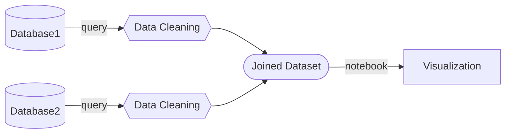

# Mermaid

Mermaid lets you create diagrams and visualizations using text and code. It is a JavaScript based diagramming and charting tool that renders Markdown-inspired text definitions to create and modify diagrams dynamically.

I am particularly interested in leveraging this because most data science work that is organized on GitHub uses markdown readme files to explain the contents. This is a great way to add visualizations to those files to explain the flow of what is being processed in a data curation to visually show the concept of what is trying to be accomplished.

- [Documentation](https://mermaid.js.org/intro/)
- [Live Editor](https://mermaid-js.github.io/mermaid-live-editor/)

