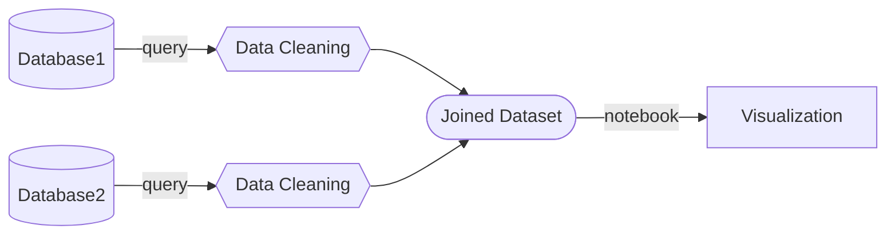

# Flowchart

[Flowchart Documentation](https://mermaid.js.org/syntax/flowchart.html)

```
flowchart LR
    db1[(Database1)]--query-->dc1{{Data Cleaning}};
    db2[(Database2)]--query-->dc2{{Data Cleaning}};
    dc1-->id1([Joined Dataset]);
    dc2-->id1;
    id1--notebook-->Visualization

```


